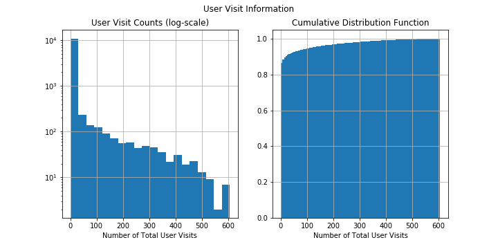
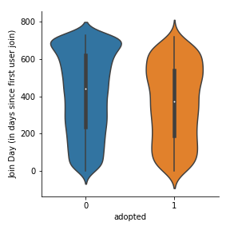
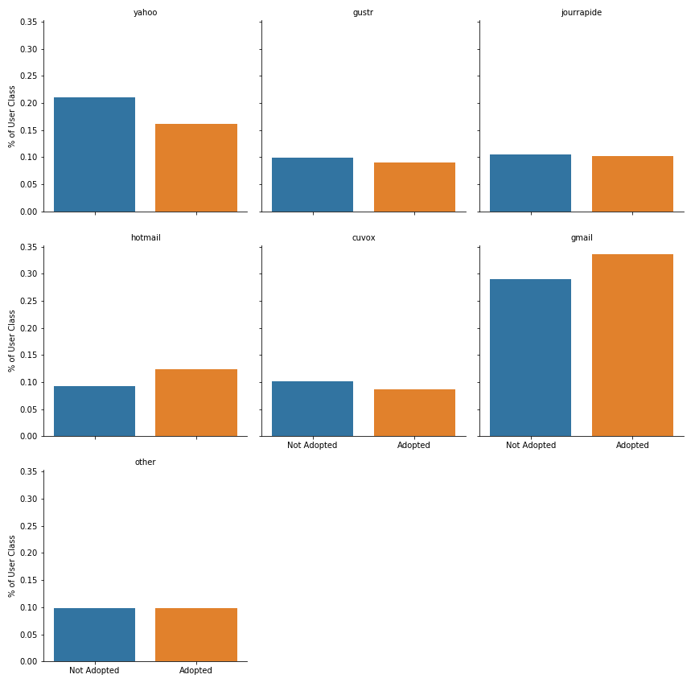
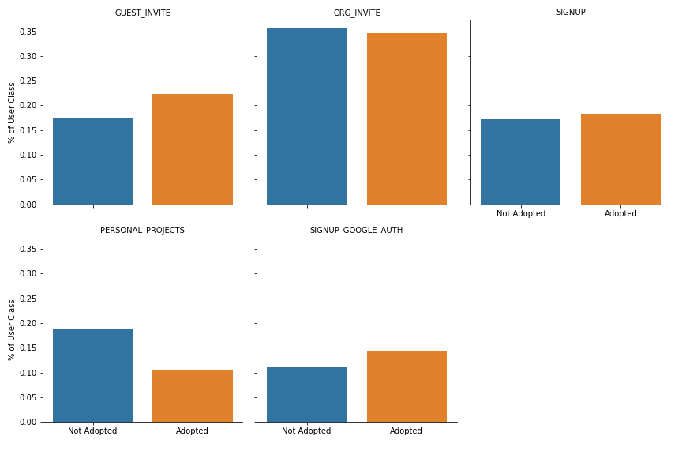
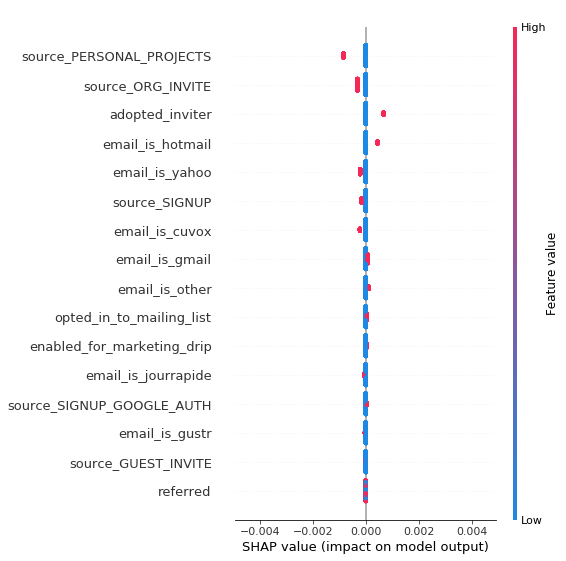
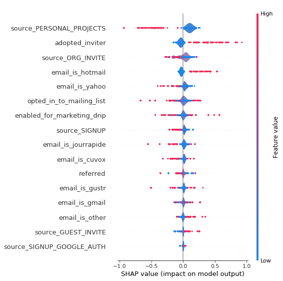

# Future User Adoption Predictors

> **Note:** Fine details of analysis (munging, cleaning, and feature extraction) are available in the [notebook](https://github.com/gmlander/Springboard/blob/master/Assessments/Relax%20Challenge/relax.ipynb) of this repo.

*Initial Exploratory Findings:*
- 13.8% of users adopted. Nearly 25% of users created accounts but never once used the product.
- [Visit information][1] suggests most users barely use the product, but this who do use it quite a bit.
- The user's [email address][3] was a strong indicator for certain email clients. A similar effect observed with [creation source][4].

#### Model Building

The goal was interprettability and explainablity, typically that means logistic regression, but I wanted to try a new package, [SHAP](https://github.com/slundberg/shap), which interprets a model against its data to evaluate feature influence (even for black-box models). I used LightGBM and AdaBoost (with a stump tree as its weak classifier), getting similar [accuracy][9].

> *Features excluded from the model:*  

- Datetime features
- Many-valued categoricals (like org id). Features may improve accuracy, but obstruct the discovery of more actionable insights.
- Features beyond company control (last session, visits, [join lag][2]). Strong correlations with the target, but also obstruct better insights (same reason you wouldn't tell a football team they'll win if they score more points).  

## Conclusions: Best Predictors for User-Adoption

Model results were limited to vague feature importance values (figures [3.1][5] and [4.1][7]). None of them were very useful since they were directionless, e.g. no way to know if `opted_in_to_mailing_list` raised or lowered likelihood of adoption, only that it's important to the model. SHAP summary plots (figures [3.2][6] and [4.2][8]) solved this problem by adding context to the features and allowed for the following takeaways. 

**Strong Positive Predictors** (user more likely to adopt):  
- The user was invited by another adopted user
- The user has a hotmail account

    **Weak Positive Predictors**
    - Email is gmail or 'other'.
    - User opted to receive marketing mail and/or is on a regular marketing drip
    - User created their account using their gmail address as their user id.

**Strong Negative Predictors** (user less likely to adopt):
- The user created their account when invited to join another user's personal project or by an organization.
   
    **Weak Negative Predictors**
    - Email is yahoo or cuvox
    - The user signed up through the website.
    
    
[1]: #visit-activity-figure-1
[2]: #join-lag-figure-21
[3]: #email-figure-22
[4]: #invite-source-figure-23
[5]: #feature-importance-figure-31
[6]: #shap-summary-plot-figure-32
[7]: #feature-importance-figure-41
[8]: #shap-summary-plot-figure-42
[9]: #model-results

## Supplemental Materials

#### Visit Activity (Figure 1)

---

### Adoption By Categorical Feature Split
#### Join Lag (Figure 2.1)

---

#### Email (Figure 2.2)

---

#### Invite Source (Figure 2.3)

---

### AdaBoost

#### Feature Importance (Figure 3.1)

Feature | Importance 
:--- | --- 
source_SIGNUP_GOOGLE_AUTH   |  0.075
enabled_for_marketing_drip   | 0.065
opted_in_to_mailing_list     | 0.055
adopted_inviter             |  0.050
source_PERSONAL_PROJECTS   |   0.050
source_SIGNUP              |   0.045
email_is_cuvox             |   0.045
email_is_hotmail           |   0.045
email_is_other             |   0.040
email_is_gmail            |    0.040

#### SHAP Summary Plot (Figure 3.2)

This plot can be hard to interpret at first, but it gives a lot of information. Higher values of a variable are encoded as red, lower as blue. For binary features that means red when true blue when false. Importance for positive/negative prediction of a feature is displayed by position of its points on the x axis. For example, red values to the left mean a user will be less likely to adopt if that feature is true.

---

### LightGBM

#### Feature Importance (Figure 4.1)

Feature | Importance 
:--- | --- 
opted_in_to_mailing_list     | 1774
enabled_for_marketing_drip   | 1321
email_is_gmail               |  770
email_is_gustr              |   521
email_is_cuvox              |   453
email_is_jourrapide         |   429
email_is_yahoo              |   394
referred                   |    358
email_is_other             |    308
email_is_hotmail           |    292

#### SHAP Summary Plot (Figure 4.2)

This plot can be hard to interpret at first, but it gives a lot of information. Higher values of a variable are encoded as red, lower as blue. For binary features that means red when true blue when false. Importance for positive/negative prediction of a feature is displayed by position of its points on the x axis. For example, red values to the left mean a user will be less likely to adopt if that feature is true.

#### Model Results

Model | Training Accuracy | Testing Accuracy
:--- | ---: | ---:
AdaBoost   |  86.25% | 86.08%
LightGBM   | 86.31% | 86.06%

For a model built on nothing but a handful of categorical features, that's actually pretty good.
